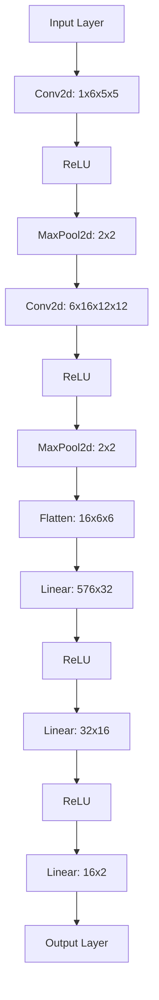

### Detailed Explanation of Spatial Dimensions

1. **Input Layer**: The network starts with a 36x36 input image.

2. **First Convolutional Layer (Conv2d: 1x6x5x5)**:
   - The input image is convolved with 6 filters of size 5x5.
   - This reduces the spatial dimensions from 36x36 to 32x32 (since a 5x5 kernel reduces each dimension by 4).

3. **ReLU Activation**: Applies a ReLU activation function, which does not change the dimensions.

4. **First Max Pooling Layer (MaxPool2d: 2x2)**:
   - A 2x2 pooling operation with stride 2 is applied.
   - This reduces the dimensions from 32x32 to 16x16.

5. **Second Convolutional Layer (Conv2d: 6x16x12x12)**:
   - The 16x16x6 feature maps are convolved with 16 filters of size 5x5.
   - This reduces the spatial dimensions from 16x16 to 12x12.

6. **ReLU Activation**: Again, applies a ReLU activation function, which does not change the dimensions.

7. **Second Max Pooling Layer (MaxPool2d: 2x2)**:
   - Another 2x2 pooling operation with stride 2 is applied.
   - This reduces the dimensions from 12x12 to 6x6.

8. **Flatten Layer (Flatten: 16x6x6)**:
   - The 6x6x16 feature maps are flattened into a 1D vector of size 576 (16 channels * 6 height * 6 width).

9. **First Fully Connected Layer (Linear: 576x32)**:
   - The flattened vector is fed into a fully connected layer with 32 outputs.

10. **ReLU Activation**: Applies a ReLU activation function.

11. **Second Fully Connected Layer (Linear: 32x16)**:
   - The 32-dimensional vector is fed into another fully connected layer with 16 outputs.

12. **ReLU Activation**: Applies a ReLU activation function.

13. **Output Layer (Linear: 16x2)**:
   - The 16-dimensional vector is fed into the final output layer, producing 2 outputs (one for each class).

